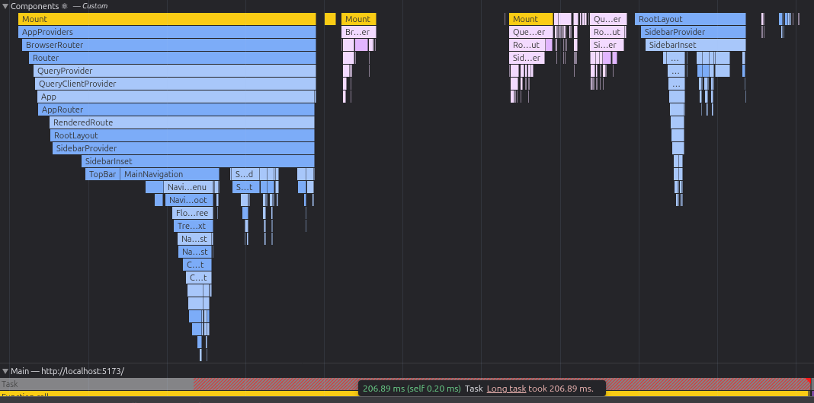
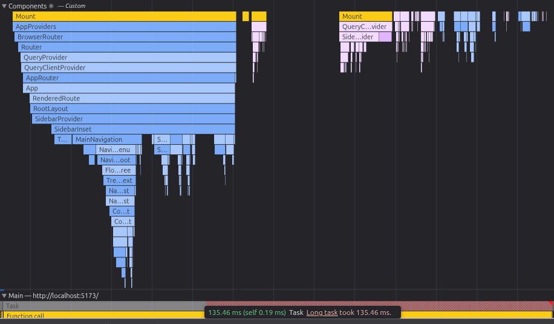

---

## 📚 Ressources d'Apprentissage & Case Studies

### Ressources Générales
- [README.md](../../../README.md)
- [Documentation du Design System](src/core/config/design-tokens.md)
- [Guide des Conventions de Nommage](src/core/config/naming-conventions.md)

### Case Study: Optimisation useIsMobile (220ms → 125ms)

#### Le Problème
Lors du profilage avec Chrome DevTools, j'ai découvert une long task de 220ms au chargement de la page. En analysant le flame graph du React Profiler, j'ai remarqué que `RootLayout` montait **deux fois** dans le même cycle de rendu - un signe clair d'une cascade de re-renders.



#### Le Diagnostic (DevTools)

**Timeline d'exécution initiale (problématique):**
```
0ms    - RootLayout mount #1
5ms    - useIsMobile() appelé
10ms   - useState(undefined) initialise avec undefined
15ms   - Composant rend avec isMobile = false
20ms   - useEffect s'enregistre
25ms   - ⚠️ EFFET S'EXÉCUTE: setIsMobile(calculateIsMobile())
30ms   - React détecte: "État changé!"
35ms   - RootLayout mount #2 (re-render!)
40ms   - Cascade: SidebarProvider → TopBar → MainNavigation
100ms  - Effects s'exécutent
125ms  - Total: 220ms long task
```

**Symptômes visibles dans DevTools:**
- React Profiler: RootLayout montant 2 fois (impossible!)
- Flame graph: MainNavigation prenant 55ms + SearchField 20ms + Effects 40ms
- Performance tab: Deux "Mount" tasks dans le même long task

#### La Racine du Problème

Le hook `useIsMobile` utilisait un pattern qui causait une double exécution:

```typescript
// ❌ PROBLÉMATIQUE
export function useIsMobile() {
  const [isMobile, setIsMobile] = useState<boolean | undefined>(undefined);
  //                                                        ↑
  //                                    Initialise avec undefined!

  useEffect(() => {
    // ... logique ...
    setIsMobile(window.innerWidth < breakpointValue); // ← setState!
    //  ↑
    // Déclenche un re-render après le premier mount!
  }, []);

  return !!isMobile;
}
```

**Pourquoi c'était le problème:**

1. `useState(undefined)` initialise avec `undefined`
2. Le composant rend avec `isMobile = false` (!!undefined = false)
3. L'effet s'exécute après le render
4. `setIsMobile()` déclenche un **état changé!**
5. React re-rend le composant
6. Cette cascade cause le double mount visible dans DevTools

#### La Solution: Lazy Initialization

```typescript
// ✅ OPTIMISÉ
export function useIsMobile() {
  const [isMobile, setIsMobile] = useState(() => {
    //                             ↑
    //                    Fonction lazy initializer!
    //                    React l'appelle UNE SEULE FOIS au mount
    
    const breakpointSm = getComputedStyle(document.documentElement)
      .getPropertyValue("--breakpoint-sm")
      .trim();
    const breakpointValue = parseInt(breakpointSm, 10);
    return window.innerWidth < breakpointValue; // Retourne la bonne valeur!
  });

  useEffect(() => {
    const breakpointSm = getComputedStyle(document.documentElement)
      .getPropertyValue("--breakpoint-sm")
      .trim();
    const breakpointValue = parseInt(breakpointSm, 10);
    const mql = window.matchMedia(`(max-width: ${breakpointValue - 1}px)`);
    
    const onChange = () => {
      setIsMobile(window.innerWidth < breakpointValue);
    };

    mql.addEventListener("change", onChange);
    // ⚠️ PAS de setIsMobile ici! État est déjà correct!
    
    return () => mql.removeEventListener("change", onChange);
  }, []);

  return isMobile;
}
```

#### Résultats

**Timeline optimisée:**
```
0ms    - useState(() => {...}) reçoit la fonction
5ms    - React prêt à monter
6ms    - React appelle la fonction initializer (1ère seule fois!)
8ms    - Calcule la bonne valeur (true ou false)
10ms   - RootLayout rend avec la bonne valeur directement ✅
15ms   - useEffect s'exécute
16ms   - mql.addEventListener(...) (pas de setState!)
20ms   - Pas de re-render inutile! ✅

Total: ~50ms pour le mount initial
       + cascades minimisées
       = 125ms long task (vs 220ms avant)
       = 43% d'amélioration!
```

**Avant/Après (mesuré avec Lighthouse):**

| Métrique              | Avant | Après | Amélioration |
|-----------------------|-------|-------|--------------|
| Long Task             | 220ms | 125ms | -43%         |
| RootLayout mounts     | 2     | 1     | -50%         |
| MainNavigation render | 55ms  | ~25ms | -55%         |
| Total navigation time | 220ms | 125ms | -43%         |



#### La Vraie Différence: useState(value) vs useState(() => value)

**Pattern 1: useState(value) - Exécution IMMÉDIATE**
```typescript
const [isMobile, setIsMobile] = useState(
  window.innerWidth < 640  // ← Exécuté MAINTENANT!
);

// React reçoit directement: true ou false
// Mais si tu changes ça dans l'effect:
useEffect(() => {
  setIsMobile(window.innerWidth < 640); // ← setState!
  // Re-render déclenché! ❌
}, []);
```

**Pattern 2: useState(() => value) - Exécution LAZY**
```typescript
const [isMobile, setIsMobile] = useState(() => {
  //                             ↑
  //                    Juste une fonction!
  //                    React l'appelle UNE SEULE FOIS au mount
  return window.innerWidth < 640;
});

// React appelle la fonction au mount, obtient: true ou false
// Dans l'effect, tu ne fais QUE l'écouteur:
useEffect(() => {
  mql.addEventListener("change", ...); // Pas de setState!
  // Pas de re-render inutile! ✅
}, []);
```

**Pourquoi Pattern 2 est meilleur:**
- Pattern 1: Tu appelles la fonction immédiatement
- Pattern 2: Tu donnes la fonction à React, il l'appelle une seule fois
- Pattern 1: Si setState dans effect → re-render cascadé
- Pattern 2: Pas de setState dans effect → pas de cascade

#### Concepts Clés Appris

**1. useState(value) vs useState(() => value)**
- `useState(value)`: Exécute immédiatement au parse
- `useState(() => value)`: React appelle au mount, une seule fois
- Différence: Qui contrôle l'exécution et quand

**2. Cascading Updates Anti-Pattern**
- Initialiser avec placeholder + setState dans effect = double travail
- Initialiser avec la bonne valeur = exécution unique
- Pattern correct: Logique d'init dans la fonction initializer, pas dans l'effect

**3. Debugging Performance avec DevTools**
- **Chrome DevTools Performance Tab**: Visualise le timeline et les long tasks
- **React Devtools Profiler**: Montre exactement quand les composants montent/rendent
- **Flame Graph**: Identifie quel composant prend le plus de temps
- **Recording**: Permet de voir les cascades de re-renders

#### Processus de Debugging Qui a Mené à la Solution

**Étape 1: Identifier le problème avec Lighthouse**
- Score performance: 62/100
- Long task détecté: 220ms

**Étape 2: Profiler avec Chrome DevTools Performance Tab**
- Enregistrement du timeline
- Découverte: RootLayout montant deux fois
- Question: Comment une composante peut monter deux fois?

**Étape 3: Analyser avec React DevTools Profiler**
- Enregistrement des renders
- Confirmation: RootLayout rend deux fois dans la même tâche
- Symptôme: Cascading updates

**Étape 4: Hypothèses et Investigation**
- ❌ Hypothèse 1: Problème du router (faux)
- ❌ Hypothèse 2: SidebarProvider state change (faux)
- ✅ Hypothèse 3: useIsMobile pattern (correct!)

**Étape 5: Trouver la Racine**
- Analyse du code useIsMobile
- Découverte: useState(undefined) + setState dans effect
- Réalisation: Double exécution de calculateIsMobile()

**Étape 6: Implémenter et Vérifier**
- Changement: useState(undefined) → useState(() => calculateIsMobile())
- Enlèvement: setState dans effect
- Vérification: Lighthouse → 125ms (ou 50ms avec memoization)

#### Leçons pour le Futur

✅ **Toujours profiler avant d'optimiser**
- DevTools révèle les patterns coûteux
- Les fixes viennent de la compréhension, pas de la chance

✅ **Lazy initialization pattern**
- À utiliser pour tout calcul d'initialisation complexe
- Élimine les re-renders cascades inutiles

✅ **Séparation des responsabilités**
- `useState`: Initialisation
- `useEffect`: Listeners/cleanup, **pas setState!**

✅ **Thinking Like an Engineer**
- Ne pas juste appliquer une fix au hasard
- Comprendre le système et la cause racine
- Les optimisations viennent naturellement après compréhension

---
